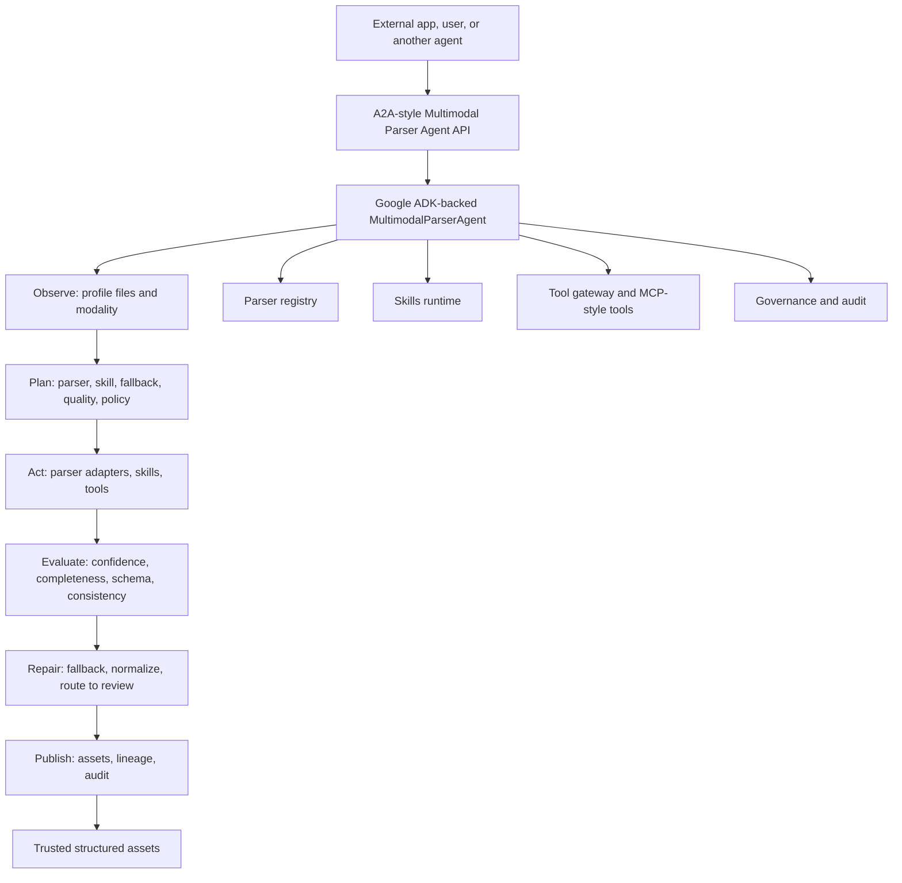
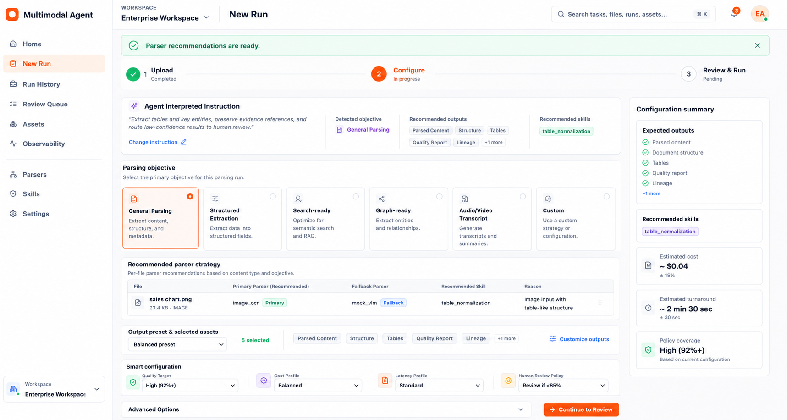
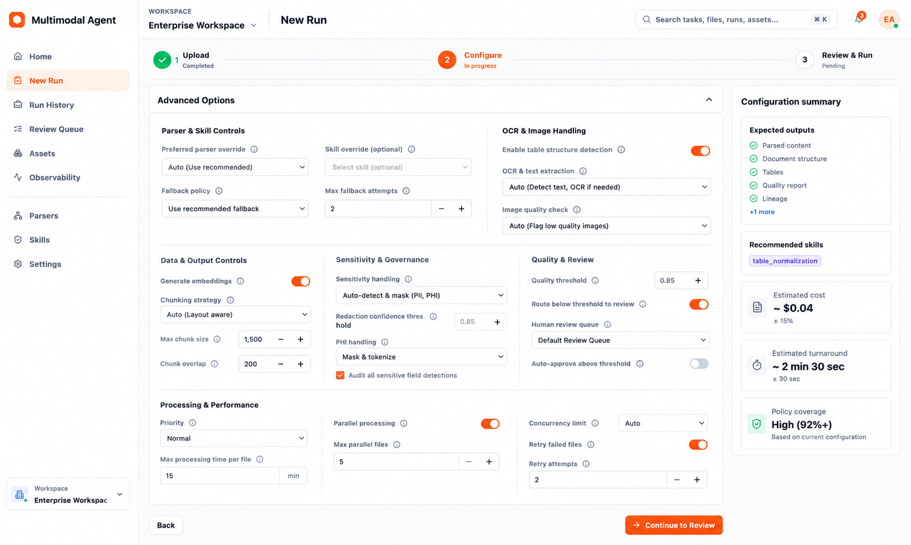

# Multimodal Processing Agent

[](#consume-it-as-an-agent-api)
[](#consume-it-as-a-web-app)
[](#current-agent-capabilities)
[](#quick-start)
[](#quick-start)
[](#deployment-notes)

An enterprise-style multimodal parser agent for turning messy files into trusted, governed, structured assets.

This repo is both:

- an **agent API** that other apps or agents can call, built around a Google ADK-backed Multimodal Parser Agent; and
- a **Next.js operations console** for uploading files, watching parser runs, reviewing uncertain output, browsing assets, and inspecting observability.

The core idea is simple: external clients should not need to know which parser, OCR engine, skill, fallback, or review rule to call. They ask one agent to transform one or more multimodal inputs into structured assets with quality, lineage, and audit context.

## At A Glance

| Surface | What it is | Best for |
| --- | --- | --- |
| **Agent API** | A2A-style FastAPI boundary around one Multimodal Parser Agent. | Apps, services, and other agents that need governed parsing by API. |
| **Operations Console** | Next.js UI for New Run, Run History, Outputs Review, Review Queue, Assets, and Observability. | Humans operating and inspecting parsing workflows. |
| **Agent Runtime** | Google ADK-backed phase agents wrapped around deterministic parser orchestration. | Explainable observe-plan-act-evaluate-repair-publish traces. |
| **Asset Publisher** | Governed `ParsedAsset` records with typed outputs, quality, lineage, and audit context. | Turning unstructured inputs into reusable structured assets. |

```text
Upload or reference data
  -> ask one parser agent
  -> agent profiles, plans, parses, evaluates, repairs, and publishes
  -> consume trusted assets through API or UI
```



## Choose Your Path

| Goal | Start here | What you will use |
| --- | --- | --- |
| Try the full app | [Quick Start](#quick-start) | `make install`, `make api`, `make web`, then `http://localhost:3000` |
| Call the agent from another service | [Consume It As An Agent API](#consume-it-as-an-agent-api) | Agent Card, task create, task status, artifacts, SSE events |
| Run API-only | [Deployment Notes](#deployment-notes) | `make agent-api`, `make agent-worker`, or the backend container |
| Add a parser | [Developer Contribution Guide](#developer-contribution-guide) | `backend/app/parsers`, parser registry metadata, parser tests |
| Add a skill | [Developer Contribution Guide](#developer-contribution-guide) | `backend/app/skills`, schema, validation rules, skill tests |
| Understand what is real today | [Implementation Status](#implementation-status) | Current vs placeholder capabilities |
| Debug setup | [Troubleshooting](#troubleshooting) | Port, env, OCR, frontend/API, SQLite/storage fixes |

## What You Can Build With This

| Use case | Entry point | Output |
| --- | --- | --- |
| Document extraction app | `POST /api/v1/agent/tasks/upload` | Parsed content, tables, entities, quality, lineage. |
| Retrieval pipeline | New Run Search preset or `selected_asset_types` with `chunks` and `vectors` | Chunks, embeddings, evidence spans. |
| Knowledge graph prep | Graph preset or `knowledge_graph_preparation` skill | Entities, relationships, graph nodes and edges. |
| Human-in-the-loop review | Run quality policy plus Review Queue | Review requests, uncertain fields, audit events. |
| Parser operations console | `make api` + `make web` | Run History, Outputs Review, Agent Trace, Observability. |

## Latest Experience

The product now behaves less like a form-driven parser and more like an agent workbench:

- New Run starts with an optional natural-language instruction. Users can tell the agent what outcome they want, or use quick chips such as Extract tables, Make search-ready, Prepare KG-ready assets, Summarize content, Validate invoice fields, and Extract contract clauses.
- The backend interprets that instruction into an objective, recommended outputs, skills, fallback posture, and review guidance. The interpretation is carried through planning and run creation.
- Configure is now a compact agent-recommended plan: objective cards, per-file parser strategy, output preset summary, smart configuration, and a collapsed Advanced Options panel.
- Output assets are customized through a drawer instead of a large always-visible grid.
- Advanced controls are first-class configuration inputs, including parser override, skill override, fallback policy, quality threshold, review policy, chunking, embeddings, sensitivity handling, retries, and performance preferences.
- New Run completed state is a concise action page with run status, quality, parser, duration, files processed, generated assets, and direct links into Run Detail, Outputs, and Agent Trace.
- Run History -> Run Detail remains the deep inspection surface for Overview, Outputs Review, and Agent Trace.

## Capability Status

| Area | Status | Notes |
| --- | --- | --- |
| Agent API | Working | Agent Card, task create/list/detail/cancel, messages, artifacts, events, SSE stream. |
| Google ADK runtime | Working | ADK-backed phase-agent wrapper around deterministic parser orchestration. |
| App console | Working | Next.js operations UI for New Run, Run History, output asset review, assets, registries, review, and observability. |
| Natural-language run instruction | Working | Optional user instruction is captured in New Run, interpreted by the backend, and included in planning/run creation payloads. |
| Agentic Configure plan | Working | Recommendation banner, interpreted instruction summary, objective cards, parser strategy, output presets, output customization drawer, smart config, and advanced options. |
| Advanced run controls | Working MVP | Parser/skill/fallback/quality/review/output/chunk/vector/sensitivity settings are captured and used or persisted in plan policy. Performance fields are persisted for worker/runtime expansion. |
| Local parsers | Working | HTML, DOCX, native PDF text, OCR paths, optional LM Studio VLM. |
| Skills | Working MVP | Folder-backed skill packs with schemas and validation rules. |
| MCP-style tools | Working MVP | Local callable registry, gateway metadata, and per-task governance allow/block trace; not a full MCP SDK transport yet. |
| Durable worker | Working local queue | `make agent-worker` processes accepted persisted agent tasks with DB-backed claims, retries, heartbeat locks, and stale-lock recovery. |
| Auth and tenancy | Planned | No production auth, RBAC, or tenant isolation yet. |
| Production migrations | Planned | Dev schema creation is lightweight; Alembic should be added. |

## Why This Exists

Most document parsing systems become a pile of one-off routes: call OCR here, call PDF parsing there, call a table extractor somewhere else, then stitch the results together in product code. This project pushes that complexity behind one public agent boundary.

The platform keeps deterministic enterprise controls separate from agentic decisioning:

| Deterministic platform controls | Agentic/intelligent decisions |
| --- | --- |
| Upload registration, checksum, storage | File profiling and modality interpretation |
| Schema validation and persistence | Parser, fallback, and skill selection |
| Governance checks and audit logs | Quality judgement and repair planning |
| Asset publishing and lineage records | Review recommendation and reasoning trace |

The result is a parser agent that is explainable enough for enterprise workflows and flexible enough to grow into OCR, VLM, speech, video, document intelligence, MCP tools, and richer domain skills.

## What Works Today

- Upload and profile HTML, DOCX, PDF, and image files.
- Parse local HTML, DOCX, native-text PDF, image OCR, and optional LM Studio VLM paths.
- Select parsers through a registry-backed planner.
- Run fallback, quality scoring, review routing, asset publishing, audit, and observability.
- Create Google ADK-backed parser-agent tasks from uploads, file IDs, multiple file IDs, inline text, existing asset IDs, and URL placeholders.
- Add optional natural-language instructions on New Run so the agent can infer objectives, outputs, parser strategy, skills, fallback posture, and review rules.
- Review an agent-recommended Configure plan with compact objective selection, parser strategy, output preset, selected asset summary, smart configuration, and advanced controls.
- Customize output assets in a drawer grouped by Core, Search & AI, Knowledge, Governance, and Custom asset families.
- Poll task status or stream persisted task events over SSE.
- Inspect agent messages, artifacts, plans, steps, decisions, parser tool calls, skill invocation records, quality judgement, subtasks, and lineage.
- Inspect per-task tool governance policy, allowed/blocked gateway tools, and planner-selectable skill metadata.
- Use New Run and Run Detail trace panels for timeline, decisions, tool policy, tool calls, skill selection, artifacts, quality, lineage, subagents, and worker state.
- Choose output asset types before execution, then inspect generated assets in Run History -> Run Detail -> Outputs.
- Search across agent tasks, files, jobs, assets, parsers, skills, and review items from the app shell or `GET /api/v1/search`.
- Use a Next.js console for Home, New Run, Run History, Run Detail, Parsers, Skills, Review Queue, Assets, Observability, and Settings.

## Current Agent Capabilities

This is what the current implementation exposes behind the Multimodal Parser Agent boundary.

### Internal Subagents

These are represented as named Google ADK phase agents and persisted subtask trace records. They are internal capabilities, not separate public products.

| Subagent | Phase | Current responsibility |
| --- | --- | --- |
| `FileProfilerAgent` | Observe | Reads persisted file profile, modality, layout, text/scanned signals, and risk hints. |
| `ParserStrategyAgent` | Plan | Selects parser, fallback, skill, quality target, cost/latency posture, and review policy. |
| `ExtractionAgent` | Act | Runs parser adapters and records parser execution outputs. |
| `QualityAgent` | Evaluate | Scores confidence, completeness, schema validity, consistency, and review need. |
| `RepairAgent` | Repair | Uses fallback policy when confidence is below threshold or primary extraction is weak. |
| `PublisherAgent` | Publish | Creates parsed assets with quality, lineage, skill output, and audit context. |

### ADK Tools And Internal Tool Gateway

The ADK runtime currently registers these function tools:

- `observe_file_profile_tool`
- `plan_parser_strategy_tool`
- `execute_parser_plan_tool`
- `evaluate_quality_tool`
- `publish_asset_tool`
- `discover_skills_tool`
- `tool_gateway_policy_tool`

The internal tool gateway currently exposes capability metadata, per-task governance filtering, and persisted planning records for:

| Tool gateway id | Category | Status |
| --- | --- | --- |
| `parser.registry` | parser selection | Local metadata-backed capability. |
| `parser.adapter` | parsing | Local parser execution path; external use is policy-gated. |
| `skill.registry` | skill selection | Local skill discovery metadata. |
| `quality.evaluator` | quality evaluation | Local quality scoring capability. |
| `asset.publisher` | asset publishing | Local governed asset publishing capability. |
| `ocr.tesseract` | OCR | Local OCR capability metadata. |
| `vlm.lmstudio` | VLM parsing | Local model capability metadata. |
| `document_intelligence.azure` | document intelligence | External placeholder; blocked unless task policy allows external services. |
| `speech.transcription` | speech transcription | External placeholder metadata. |
| `video.understanding` | video understanding | External placeholder metadata. |
| `schema.validation` | schema validation | Local validation capability metadata. |
| `table.normalization` | table normalization | Local normalization capability metadata. |
| `policy.pii` | policy checks | Local PII/policy capability metadata. |
| `embeddings.vector_search` | embeddings | External placeholder metadata, policy gated. |

Each agent task stores a `tool_policy` snapshot in `input_payload`. The completed task trace also includes `tool_policy` decisions and `AgentToolCall` rows for gateway capabilities selected by the planner, so API clients can see whether a tool was planned, allowed, or blocked by governance.

### Parser Tools

Parser adapters are pluggable through the parser registry.

| Parser id | Type | Deployment | Status |
| --- | --- | --- | --- |
| `pdf_native_text` | deterministic PDF | local | Real parser for PDFs with native text layers. |
| `docx_text` | deterministic DOCX | local | Real parser for DOCX paragraphs and tables. |
| `html_text` | deterministic HTML | local | Real parser for clean text, tables, and image metadata. |
| `image_ocr` | OCR | local | Real path when Tesseract is installed. |
| `tesseract_ocr` | OCR | local | OCR fallback for images and rendered PDF pages. |
| `mock_vlm` | VLM | local LM Studio | Calls a local OpenAI-compatible LM Studio VLM endpoint when enabled. |
| `azure_document_intelligence` | document intelligence | external | Placeholder adapter; credentials/service integration pending. |
| `audio_transcription` | speech | local | Placeholder adapter; real speech model pending. |
| `video_parser` | video | local | Placeholder adapter; real media pipeline pending. |

### MCP-Style Tools

The MVP includes a lightweight MCP-style tool registry at `GET /api/v1/mcp/tools`. It does not require the MCP SDK yet; handlers are local Python callables that can later be wrapped by a real MCP transport.

| MCP tool | What it does today |
| --- | --- |
| `parse_document` | Runs the orchestration flow for one registered file. |
| `parse_batch` | Runs parsing for multiple registered files. |
| `get_parse_status` | Returns parse job status and parser metadata. |
| `get_document_assets` | Returns parsed assets for a file. |
| `get_quality_report` | Returns the latest quality report for a job. |
| `compare_parser_outputs` | Runs selected parsers and compares confidence scores. |
| `reprocess_with_strategy` | Re-runs parsing with explicit strategy fields. |
| `submit_human_review` | Creates a human review item for a parse job. |

### Skills

Skills are folder-backed capabilities under `backend/app/skills` and are also seeded into the skills registry. Agent traces include planner-selectable skill metadata such as required inputs, produced outputs, JSON schema, validation rules, confidence behavior, cost/latency posture, parser compatibility, and examples.

| Skill id | Purpose | Supported document types |
| --- | --- | --- |
| `invoice_extraction` | Invoice numbers, vendors, totals, line items, and due dates. | PDF, DOCX, image |
| `contract_parsing` | Parties, terms, obligations, clauses, and effective dates. | PDF, DOCX |
| `research_paper_parsing` | Title, authors, abstract, sections, citations, figures, and tables. | PDF, HTML |
| `audio_meeting_parsing` | Speaker turns, action items, decisions, and meeting summaries. | audio, video |
| `table_normalization` | Typed rows, columns, units, and table cleanup. | PDF, DOCX, HTML |
| `knowledge_graph_preparation` | Entities and relationships for graph-oriented publishing. | PDF, DOCX, HTML |

### Public Agent Input And Output Modes

Supported task inputs:

- uploaded file through `POST /api/v1/agent/tasks/upload`
- `file_id`
- `file_ids`
- `text_payload`
- `asset_id`
- `url` placeholder, without remote fetching in local mode

Persisted task outputs:

- file profile
- parsing plan
- agent reasoning
- parser output
- skill output
- quality report
- fallback report when used
- review request when needed
- parsed asset
- lineage report
- audit summary

## Generated Asset Catalog

The agent can publish a single governed `ParsedAsset` record that contains many typed generated assets. New Run lets users choose the requested asset types before execution. The default baseline is intentionally minimal:

- `parsed_content`
- `document_structure`
- `tables`
- `quality_report`
- `lineage`

Objective presets add more assets when needed. For example, Search adds chunks, vectors, and evidence; Structured extraction adds entities and user-defined fields; Graph adds relationships and a knowledge graph.

Output selection is handled in the Configure step through an output preset plus a Customize Outputs drawer. The UI stays compact while still letting a developer or operator request concrete asset families for the run.

| New Run objective | Added assets | Typical consumer |
| --- | --- | --- |
| General | Minimal baseline only | Human inspection and simple extraction. |
| Search | `chunks`, `vectors`, `evidence` | RAG, semantic search, retrieval indexing. |
| Structured | `entities`, `evidence`, `user_defined_extraction` | Business workflows and schema-driven extraction. |
| Graph | `entities`, `relationships`, `knowledge_graph`, `evidence` | Knowledge graph and relationship analysis. |
| Transcript | `chunks`, `summary`, `entities`, `evidence` | Audio/video review and meeting intelligence. |

| Asset kind | What it contains | Current generation behavior | Where to view |
| --- | --- | --- | --- |
| `parsed_content` | Extracted document text or transcript text. | Generated from parser output whenever text is available. | Run Detail -> Outputs -> Parsed Content. |
| `document_structure` | Layout blocks, section-like records, and document metadata. | Built from parser layout blocks and metadata. | Run Detail -> Outputs -> Document Structure. |
| `tables` | Extracted table rows and cells. | Comes from DOCX/HTML parsers, VLM markdown tables, or parser table payloads. | Run Detail -> Outputs -> Tables. |
| `chunks` | Retrieval-ready text chunks with character offsets and token estimates. | Generated when requested for search, vectors, summaries, evidence, relationships, or graph outputs. | Run Detail -> Outputs -> Chunks. |
| `vectors` | Embedding records tied to chunks. | Uses local deterministic hashing embeddings today; LM Studio embedding configuration is available for local model use. | Run Detail -> Outputs -> Vectors. |
| `entities` | Entity records with type, text/value, confidence, and source hints. | Extracted using lightweight heuristics plus requested user-defined fields where available. | Run Detail -> Outputs -> Entities. |
| `relationships` | Source-target relationship records with confidence and evidence references. | Generated from entity and chunk signals when relationships or graph output is requested. | Run Detail -> Outputs -> Relationships. |
| `knowledge_graph` | Graph payload with nodes and edges. | Built from extracted entities and relationships for graph-oriented runs. | Run Detail -> Outputs -> Knowledge Graph. |
| `summary` | Extractive summary and key points. | Generated from parsed text/chunks using local ranking. | Run Detail -> Outputs -> Summary. |
| `classification` | Document class, file type, parser, skill, and output contract context. | Generated from file metadata, parser plan, and text hints. | Run Detail -> Outputs -> Classification. |
| `evidence` | Evidence spans connected to chunks/source offsets. | Generated from chunks and extracted signals when evidence is requested. | Run Detail -> Outputs -> Evidence. |
| `quality_report` | Parser confidence, extraction confidence, completeness, consistency, schema score, and review decision. | Always available when selected; backed by persisted quality reports. | Run Detail -> Outputs -> Quality Report. |
| `lineage` | Plan id, execution result id, source file id, storage path, parser id, and skill id. | Always available when selected; backed by asset publishing lineage. | Run Detail -> Outputs -> Lineage. |
| `review_package` | Review-focused payload with rationale and uncertain output context. | Generated when selected; review queue routing still depends on quality policy. | Run Detail -> Outputs -> Review Package and Review Queue. |
| `user_defined_extraction` | User-requested fields and matched entities. | Generated from `custom_outputs` / requested field schema hints using local matching. | Run Detail -> Outputs -> User Defined Extraction. |
| `image_understanding` | Image descriptions and visual extraction notes. | Included when a parser produces image descriptions, especially VLM/OCR paths. | Run Detail -> Outputs -> Image Understanding. |
| `audio_transcript` | Transcript text for audio inputs. | Placeholder parser path today; real speech model integration is pending. | Run Detail -> Outputs -> Audio Transcript. |
| `video_understanding` | Video transcript or visual understanding payload. | Placeholder parser path today; real video pipeline is pending. | Run Detail -> Outputs -> Video Understanding. |

The Outputs tab in Run Detail is organized as an Outputs Review workspace: metrics at the top, a main selected asset viewer, a generated-assets rail, and quick preview shortcuts for text, entities, and tables.

## Configure And Planning Controls

The Configure screen produces a plan-shaped payload instead of only a parser choice. These controls are passed into backend planning/run creation where supported, and preserved in plan policy where deeper runtime execution is still evolving.

| Control group | Examples | Current backend behavior |
| --- | --- | --- |
| Instruction and objective | `agent_instruction`, `selected_objective` | Interpreted into objective/output/skill recommendations and included in task input payload. |
| Parser strategy | Preferred parser override, fallback parser, skill override | Active in parser selection and orchestration where parser/skill metadata supports it. |
| Output contract | Preset, selected asset types, custom fields | Drives generated asset payloads and Run Detail Outputs. |
| Smart configuration | Quality target, cost profile, latency profile, human review policy | Quality/review choices are active; cost/latency posture is captured for planning and future schedulers. |
| Advanced extraction | OCR/table detection, image understanding, chunk size, overlap, vectors | Output and chunk/vector options are active; image/OCR options are captured and honored where parser adapters expose support. |
| Governance | Sensitivity handling, PHI policy, audit sensitive detections | Captured in plan policy and ready for stricter policy packs. |
| Processing | Priority, max processing time, parallelism, retries | Persisted for worker/runtime expansion; local worker currently remains conservative. |

## Screenshots

The UI is intentionally compact and operations-focused. The screenshots below are the current wireframe-aligned app screens and latest New Run configuration references in this repo.

| Home | New Run |
| --- | --- |
| <br>Operational entry point for recent activity, parser health, review pressure, and starting parsing work. | <br>Upload, configure output assets, and create agent-backed parsing runs. |

| New Run Configure | Advanced Options |
| --- | --- |
| <br>Agent recommendations, interpreted instruction, objective cards, parser strategy, output preset summary, smart config, and sticky configuration rail. | <br>Collapsed-by-default advanced controls for parser overrides, fallback, OCR/image handling, chunking, embeddings, governance, review, and processing. |

| Run History | Review Queue |
| --- | --- |
| <br>Run history, parser choice, quality state, generated outputs, and operational metadata. | <br>Human review queue for uncertain outputs, low-confidence fields, and review rationale. |

| Assets | Observability |
| --- | --- |
| <br>Published parsed assets with structured output, lineage, parser, quality, and confidence context. | <br>System, parser, quality, and audit signals for operating the parsing platform. |

## Quick Start

Prerequisites:

- Python 3.12+
- Node.js 20+
- npm
- Optional: Docker and Docker Compose
- Optional for OCR: local `tesseract` binary

Install everything:

```bash
make install
cp .env.example .env
```

Run the backend and frontend in two terminals:

```bash
make api
make web
```

Open:

- App: `http://localhost:3000`
- API docs: `http://localhost:8000/docs`
- Agent Card: `http://localhost:8000/.well-known/agent-card.json`

API-only agent mode:

```bash
make install-api
make agent-api
```

Run the persisted task worker in another terminal when you want accepted parser-agent tasks processed outside the API process:

```bash
make agent-worker
```

Worker behavior is controlled by:

| Setting | Default | Purpose |
| --- | --- | --- |
| `AGENT_TASK_BACKGROUND_ENABLED` | `true` | Runs API-created tasks through the worker in a FastAPI background task for local dev. Set to `false` when dedicated workers are the only executors. |
| `AGENT_TASK_MAX_ATTEMPTS` | `3` | Maximum attempts before a task remains failed. |
| `AGENT_TASK_LOCK_TIMEOUT_SECONDS` | `300` | Worker claim/heartbeat lock duration. Expired locks are recovered by another worker. |
| `AGENT_TASK_RETRY_BACKOFF_SECONDS` | `30` | Base retry delay after failed attempts. |

Docker:

```bash
make docker-up
```

Services:

- API: `http://localhost:8000`
- Web: `http://localhost:3000`
- PostgreSQL: `localhost:5432`

## Ten-Minute Happy Path

This is the quickest copy-paste path to prove the agent works locally.

### Terminal 1: Start The API

```bash
make install-api
cp .env.example .env
make agent-api
```

Wait until the API is serving on `http://localhost:8000`.

### Terminal 2: Create And Inspect An Agent Task

```bash
curl http://localhost:8000/api/v1/health

curl -F "file=@sample_files/invoice.html;type=text/html" \
  http://localhost:8000/api/v1/agent/tasks/upload
```

Copy the returned `task.id`, then inspect it:

```bash
TASK_ID="replace-with-task-id"

curl http://localhost:8000/api/v1/agent/tasks/$TASK_ID
curl http://localhost:8000/api/v1/agent/tasks/$TASK_ID/artifacts
curl http://localhost:8000/api/v1/agent/tasks/$TASK_ID/events
```

Start the frontend:

```bash
make web
```

Open `http://localhost:3000`, then visit Home, New Run, Run History, Assets, and Observability.

Expected result:

- the task reaches `completed` or `awaiting_review`
- artifacts include `file_profile`, `parsing_plan`, `parser_output`, `quality_report`, `parsed_asset`, `lineage_report`, and `agent_reasoning`
- a parsed asset is created with parser, quality, lineage, and audit context

## Consume It As An Agent API

The preferred integration path is the parser-agent task API.

### 1. Discover The Agent

```bash
curl http://localhost:8000/.well-known/agent-card.json
curl http://localhost:8000/api/v1/agent/card
```

The Agent Card describes supported modalities, input modes, output modes, skills, ADK runtime metadata, tool gateway metadata, streaming support, and endpoints.

### 2. Create A Task From Upload

```bash
curl -F "file=@sample_files/invoice.html;type=text/html" \
  http://localhost:8000/api/v1/agent/tasks/upload
```

The response includes an accepted task. In local dev, execution continues through the persisted worker claim flow inside a FastAPI background task. With `AGENT_TASK_BACKGROUND_ENABLED=false`, a dedicated `make agent-worker` process claims and executes queued tasks.

### 3. Create A Task From Existing Inputs

Use a registered `file_id`:

```bash
curl -X POST http://localhost:8000/api/v1/agent/tasks \
  -H "Content-Type: application/json" \
  -d '{
    "file_id": "replace-with-file-id",
    "requested_output_contract": {
      "parsed_text": true,
      "tables": true,
      "entities": true,
      "relationships": true,
      "evidence": true,
      "quality_report": true,
      "lineage": true,
      "selected_asset_types": [
        "parsed_content",
        "document_structure",
        "tables",
        "entities",
        "relationships",
        "evidence",
        "quality_report",
        "lineage"
      ]
    },
    "quality_target": "balanced",
    "cost_profile": "balanced",
    "latency_profile": "interactive",
    "governance_constraints": {
      "external_services_allowed": false
    }
  }'
```

Use multiple files:

```bash
curl -X POST http://localhost:8000/api/v1/agent/tasks \
  -H "Content-Type: application/json" \
  -d '{
    "file_ids": ["first-file-id", "second-file-id"],
    "requested_output_contract": {"parsed_text": true, "tables": true}
  }'
```

Use inline text:

```bash
curl -X POST http://localhost:8000/api/v1/agent/tasks \
  -H "Content-Type: application/json" \
  -d '{
    "text_payload": "Invoice INV-123 from Example Corp for $42.00",
    "requested_output_contract": {"parsed_text": true, "entities": true}
  }'
```

Other supported input modes:

- `asset_id`: materializes an existing parsed asset as a new agent input.
- `url`: records a governed local URL placeholder. The local runtime does not fetch remote content yet.

Task governance currently supports these policy fields:

| Field | Effect |
| --- | --- |
| `external_services_allowed` or `allow_external_services` | Allows gateway tools that require external services. Defaults to `false`. |
| `allowed_tool_ids` | Optional allowlist; tools outside it are blocked in the policy snapshot. |
| `blocked_tool_ids` or `denied_tool_ids` | Blocks named tools even if category or external-service policy would allow them. |
| `blocked_tool_categories` | Blocks all tools in matching gateway categories. |

### 4. Track Status, Messages, Events, And Artifacts

```bash
curl http://localhost:8000/api/v1/agent/tasks/{task_id}
curl http://localhost:8000/api/v1/agent/tasks/{task_id}/messages
curl http://localhost:8000/api/v1/agent/tasks/{task_id}/artifacts
curl http://localhost:8000/api/v1/agent/tasks/{task_id}/events
curl http://localhost:8000/api/v1/agent/tasks/{task_id}/events/stream
```

Tasks move through this lifecycle:

```text
submitted -> accepted -> observing -> planning -> executing
-> evaluating -> repairing -> publishing -> completed
```

They can also become `awaiting_review`, `cancelled`, or `failed`.

### 5. Example Response Shapes

Agent Card summary:

```json
{
  "name": "multimodal-parser-agent",
  "display_name": "Multimodal Parser Agent",
  "capabilities": [
    "google_adk_runtime",
    "file_profiling",
    "parser_selection",
    "parsing",
    "quality_evaluation",
    "asset_publishing"
  ],
  "input_modes": ["uploaded_file", "file_id", "asset_id", "url_placeholder", "text_payload"],
  "streaming": {"supported": true, "transport": "pollable_events_and_sse"}
}
```

Task creation response:

```json
{
  "task": {
    "id": "uuid",
    "status": "accepted",
    "title": "Parse invoice.html",
    "summary": "Parser-agent task accepted and queued for background execution.",
    "file_id": "uuid",
    "job_id": null,
    "input_payload": {
      "file_id": "uuid",
      "materialized_file_ids": ["uuid"],
      "input_count": 1
    }
  }
}
```

Task detail response, abbreviated:

```json
{
  "id": "uuid",
  "status": "completed",
  "job_id": "uuid",
  "plan": {"selected_parser_id": "html_text", "selected_skill_id": null},
  "steps": [{"kind": "observe", "status": "completed"}],
  "quality_judgement": {"status": "passed"},
  "lineage": {"asset_id": "uuid"},
  "artifacts": [
    {"kind": "file_profile", "title": "File profile"},
    {"kind": "parsing_plan", "title": "Parsing plan"},
    {"kind": "parser_output", "title": "Parser output: html_text"},
    {"kind": "quality_report", "title": "Quality report"},
    {"kind": "parsed_asset", "title": "Parsed asset"},
    {"kind": "agent_reasoning", "title": "Agent reasoning"}
  ]
}
```

Artifact response item:

```json
{
  "id": "uuid",
  "task_id": "uuid",
  "kind": "parsed_asset",
  "sequence": 14,
  "title": "Parsed asset",
  "summary": "Published governed parsed asset uuid.",
  "payload": {
    "id": "uuid",
    "parser_used": "html_text",
    "structured_data": {},
    "quality_report": {},
    "lineage": {}
  }
}
```

### 6. Minimal Python Client

```python
import time
import requests

base_url = "http://localhost:8000/api/v1"

with open("sample_files/invoice.html", "rb") as file:
    response = requests.post(
        f"{base_url}/agent/tasks/upload",
        files={"file": ("invoice.html", file, "text/html")},
        timeout=30,
    )
response.raise_for_status()
task_id = response.json()["task"]["id"]

while True:
    task = requests.get(f"{base_url}/agent/tasks/{task_id}", timeout=30).json()
    if task["status"] in {"completed", "awaiting_review", "failed", "cancelled"}:
        break
    time.sleep(0.5)

artifacts = requests.get(f"{base_url}/agent/tasks/{task_id}/artifacts", timeout=30).json()
print(task["status"])
print([artifact["kind"] for artifact in artifacts])
```

## Consume It As A Web App

Run `make api` and `make web`, then open `http://localhost:3000`.

Core screens:

- **Home**: operational snapshot, recent runs, parser health, review pressure, and entry points into parsing.
- **New Run**: file upload, parser-agent configuration, output asset selection, governance preferences, and run submission.
- **Run History**: run list, status, parser used, quality, review state, and operational metadata.
- **Run Detail**: plan, quality, Outputs Review, audit, execution context, and the full agent trace for a specific run.
- **Parsers**: parser registry, supported file types, strengths, weaknesses, deployment mode, and usage signals.
- **Skills**: folder-backed skill packs, extraction schemas, validation rules, and supported document types.
- **Review Queue**: uncertain outputs and rationale for human review.
- **Assets**: published structured assets with lineage and confidence context.
- **Observability**: quality, parser usage, audit, and system health views.
- **Settings**: local configuration and environment-oriented controls.

## API Surface

Base URL: `http://localhost:8000/api/v1`

Important routes:

| Area | Routes |
| --- | --- |
| Health | `GET /health` |
| Files | `POST /files/upload`, `GET /files/{file_id}`, `GET /files/{file_id}/profile` |
| Agent | `GET /agent/card`, `POST /agent/tasks`, `POST /agent/tasks/upload`, `GET /agent/tasks/{task_id}`, `POST /agent/tasks/{task_id}/cancel` |
| Agent Trace | `GET /agent/tasks/{task_id}/messages`, `/artifacts`, `/events`, `/events/stream` |
| Run History / Jobs | `POST /jobs`, `POST /jobs/plan`, `GET /jobs`, `GET /jobs/{job_id}` |
| Assets | `GET /assets/{asset_id}`, `GET /files/{file_id}/assets`, `GET /jobs/{job_id}/assets` |
| Registries | `GET /parser-registry`, `GET /skills-registry` |
| Search | `GET /search?q=...&limit=20` |
| Observability | `GET /observability/summary`, `GET /audit/events` |
| MCP Demo | `GET /mcp/tools` |

More examples:

- [docs/api_examples.md](docs/api_examples.md)
- [docs/api_contract.md](docs/api_contract.md)
- [docs/architecture.md](docs/architecture.md)
- [docs/mcp_design.md](docs/mcp_design.md)

## Parser And Modality Support

| Input | Primary local parser | Behavior |
| --- | --- | --- |
| PDF with text layer | `pdf_native_text` | Extracts page text and layout blocks with PyMuPDF. |
| Scanned PDF | `tesseract_ocr` or `mock_vlm` fallback | Renders pages for local OCR or VLM parsing. |
| DOCX | `docx_text` | Extracts paragraphs and tables with `python-docx`. |
| HTML | `html_text` | Extracts clean text, tables, and image metadata with BeautifulSoup. |
| Image | `image_ocr` | Runs local Tesseract OCR when available, otherwise routes to fallback/review paths. |
| Local VLM | `mock_vlm` | Compatibility parser id that calls LM Studio when `LM_STUDIO_ENABLED=true`. |

For local image OCR on macOS:

```bash
brew install tesseract
```

For local VLM parsing with LM Studio, configure:

```env
LM_STUDIO_ENABLED=true
LM_STUDIO_BASE_URL="http://localhost:1234/v1"
LM_STUDIO_VLM_MODEL="google/gemma-4-12b"
LM_STUDIO_EMBEDDING_ENABLED=true
LM_STUDIO_EMBEDDING_MODEL="text-embedding-nomic-embed-text-v1.5"
```

## Project Layout

```text
backend/app/api/routes      FastAPI route modules
backend/app/agent_adk       Google ADK runtime and ADK tool wrappers
backend/app/services        orchestration, profiling, selection, quality, audit, observability
backend/app/parsers         parser adapters and parser base contracts
backend/app/skills          folder-based skill packs
backend/app/models          SQLAlchemy persistence models
backend/app/schemas         Pydantic API contracts
frontend/app                Next.js App Router screens
frontend/api                typed frontend API clients
frontend/components         shared UI and shell components
docs                        architecture, API, MCP, and examples
sample_files                local files for manual testing
application wireframes      UI reference screenshots
tests                       backend unit and service tests
```

## Configuration

See [.env.example](.env.example).

Common variables:

| Variable | Purpose |
| --- | --- |
| `DATABASE_URL` | SQLite or PostgreSQL SQLAlchemy URL. |
| `STORAGE_DIR` | Local file storage directory. |
| `MAX_UPLOAD_BYTES` | Upload size limit. |
| `CORS_ORIGINS` | JSON array of allowed frontend origins. |
| `NEXT_PUBLIC_API_BASE_URL` | Frontend API base URL. |
| `TESSERACT_CMD` | Optional path to the `tesseract` binary. |
| `LM_STUDIO_ENABLED` | Enable local VLM parsing. |
| `LM_STUDIO_BASE_URL` | OpenAI-compatible LM Studio base URL. |
| `LM_STUDIO_VLM_MODEL` | Local VLM model name. |
| `LM_STUDIO_EMBEDDING_ENABLED` | Enable local embeddings. |
| `LM_STUDIO_EMBEDDING_MODEL` | Local embedding model name. |

## Verification

Backend:

```bash
make verify-api
```

Frontend:

```bash
make verify-web
```

Everything:

```bash
make verify
```

Cleanup generated files:

```bash
make clean
```

Cleanup generated files plus local database/storage:

```bash
make clean-state
```

## Implementation Status

Use this table to understand what is production-like today and what is intentionally still an MVP placeholder.

| Capability | Current state | What to add for production |
| --- | --- | --- |
| Agent Card and task API | Working | Add auth, tenancy, quotas, and stronger schema/version compatibility. |
| Task execution | DB-backed queue with worker claims, retries, heartbeat locks, and stale-lock recovery | Dedicated production queue backend, dead-letter handling, concurrency controls, and operational dashboards. |
| Event streaming | Persisted events plus SSE polling stream | Dedicated event bus or websocket/SSE broker for multi-instance deployments. |
| Natural-language planning | Working instruction interpreter and UI state propagation | Model-backed planner refinement, evaluation sets, and richer prompt/schema grounding. |
| Configure plan controls | Working MVP for objective, parser override, fallback, outputs, quality, review, chunk/vector, and sensitivity policy | Deeper scheduler/runtime enforcement for cost, latency, parallelism, timeout, and retry policies. |
| File upload and local storage | Working local filesystem storage | Object storage, retention policies, antivirus/malware scanning, encryption. |
| SQLite dev database | Working for local use | PostgreSQL plus Alembic migrations and operational backups. |
| HTML, DOCX, native PDF parsing | Working local parsers | Broader fixtures, benchmarks, and parser-specific quality calibration. |
| Image OCR | Works when Tesseract is installed | OCR packaging, language packs, image preprocessing, confidence calibration. |
| LM Studio VLM | Optional local adapter | Managed model routing, cost controls, redaction, data residency policy. |
| Azure Document Intelligence | Placeholder adapter | Credentials, SDK integration, policy controls, tests, cost/latency accounting. |
| Audio transcription | Placeholder adapter | Speech model integration, diarization, timestamps, language detection. |
| Video parsing | Placeholder adapter | Frame sampling, audio extraction, visual summarization, transcript alignment. |
| URL input | Local placeholder only | Fetching, allowlists, robots/policy checks, content storage, SSRF protection. |
| MCP-style tools | Local callable registry plus persisted gateway policy trace | Full MCP SDK transport, auth, remote tool execution, richer audit, remote tool governance. |
| Skills | Working MVP skill packs plus planner metadata in agent traces | Skill evaluation sets, deeper quality calibration, richer compatibility scoring. |
| Review queue | Review items can be created and approve/reject decisions persist | Feedback into quality/training loops and reviewer assignment. |
| Auth and tenancy | Not implemented | API keys/OAuth, RBAC, tenant isolation, audit actor identity. |
| Global search | Working DB-backed search | Add indexed search, highlighting, permissions, and audit-log coverage for production scale. |

## Deployment Notes

### API-Only Agent Deployment

Use this when another app or another agent will consume only the parser-agent API.

```bash
make install-api
make agent-api
make agent-worker
```

Minimum production concerns:

- set `DATABASE_URL` to PostgreSQL
- set `STORAGE_DIR` to durable storage or replace local storage with object storage
- configure CORS for known clients only
- add authentication before exposing the API outside a trusted network
- set `AGENT_TASK_BACKGROUND_ENABLED=false` when dedicated workers should be the only executors
- run one or more `make agent-worker` processes for DB-backed persisted task execution
- replace the DB-backed local queue with a production queue backend before high-concurrency multi-instance deployment

### Full App Deployment

Use this when humans need the operations console.

```bash
make docker-up
```

The frontend expects:

```env
NEXT_PUBLIC_API_BASE_URL="http://localhost:8000/api/v1"
```

For hosted environments, point that value at the deployed API base URL.

### Recommended Production Additions

- Alembic migrations.
- API authentication and tenant isolation.
- Production queue backend and worker dashboard.
- Object storage for uploaded files and generated artifacts.
- Secrets management for model and cloud parser credentials.
- Structured logs, metrics, tracing, and alerting.
- Policy packs for external tools, data residency, PII, and restricted documents.

## Troubleshooting

| Symptom | Likely cause | Fix |
| --- | --- | --- |
| `make api` cannot start | Port 8000 is already in use | Run with `API_PORT=8001 make api` or stop the existing process. |
| Frontend cannot reach API | Wrong API base URL or backend not running | Start `make api` and set `NEXT_PUBLIC_API_BASE_URL="http://localhost:8000/api/v1"`. |
| Upload works but OCR output is empty | Tesseract is missing or image quality is low | Install `tesseract`, set `TESSERACT_CMD` if needed, try a clearer image. |
| `mock_vlm` does not work | LM Studio is disabled or model lacks image support | Set LM Studio env vars and use an image-capable local model. |
| Agent task stays non-terminal | Worker is not running, lock has not expired yet, or task keeps failing retries | Start `make agent-worker`, check `attempt_count`, `worker_id`, `lock_expires_at`, and API logs. |
| `local.db` has stale data | Local SQLite dev state persisted across runs | Run `make clean-state`. |
| `npm run dev` fails | Dependencies missing or stale | Run `cd frontend && npm ci`. |
| Import or package errors | Backend venv is missing dependencies | Run `make install-api` or `pip install -e ".[dev,postgres]"` in the active venv. |
| Docker web cannot call API | Frontend env points to localhost from the wrong network context | Set `NEXT_PUBLIC_API_BASE_URL` for the deployed browser-facing API URL. |

## Current Limitations

This is a strong local MVP, not a production deployment template yet.

- Agent execution can run through FastAPI `BackgroundTasks` backed by the same persisted worker claim flow, or through dedicated `make agent-worker` processes.
- URL input is recorded as a local placeholder; remote fetching is not implemented.
- Azure Document Intelligence, speech transcription, and video parsing adapters are placeholders.
- Legacy `.doc` files are not parsed directly; convert to DOCX or PDF.
- OCR quality depends on local Tesseract and source image quality.
- LM Studio VLM parsing requires a local model with image support.
- PII and restricted document detection use lightweight heuristics.
- SQLite schema creation is lightweight; production should use Alembic migrations.
- Authentication, authorization, tenant isolation, and secrets management are not implemented.
- Global search is DB-backed and scoped to core workspace records; production should add indexing, permissions, highlighting, and audit-log coverage.

## Roadmap

Near-term priorities:

- Replace the DB-backed local queue with a production queue backend and dead-letter workflow.
- Add dedicated full-page agent task details and artifact diff/inspection views.
- Add indexed search with highlighting, saved filters, permissions, and audit-log coverage.
- Add production migrations, auth, tenant isolation, and policy packs.

Capability expansion:

- Real Azure Document Intelligence adapter.
- Real audio transcription adapter.
- Real video understanding adapter.
- Real execution adapters behind the tool gateway for external OCR, VLM, vector search, PII checks, schema validation, and table normalization where local placeholders are not enough.

## Good First Developer Paths

- **API integrator**: start with `POST /api/v1/agent/tasks/upload`, then read artifacts and events.
- **Frontend developer**: wire New Run/Home flows to agent tasks and render the task timeline.
- **Parser developer**: add a parser adapter under `backend/app/parsers` and register it in the parser registry seed data.
- **Skill developer**: add a skill pack under `backend/app/skills` with schema, validation rules, and examples.
- **Platform developer**: replace the DB-backed local queue with a production queue backend, dead-letter workflow, and worker dashboard.

## Developer Contribution Guide

### Add A Parser

1. Create or update a parser adapter under `backend/app/parsers`.
2. Implement the parser base contract from `backend/app/parsers/base.py`.
3. Add parser metadata in `backend/app/services/parser_registry.py`.
4. Ensure the parser advertises supported file types and modalities.
5. Add tests for parser support and execution behavior.
6. Run:

```bash
make verify-api
```

Good parser additions include:

- a real Azure Document Intelligence adapter
- stronger PDF table extraction
- better HTML readability cleanup
- image preprocessing before OCR
- speech transcription
- video frame/audio parsing

### Add A Skill

1. Create a folder under `backend/app/skills/{skill_id}`.
2. Add `SKILL.md`, `schema.json`, and `validation_rules.yaml`.
3. Add examples under the skill folder when useful.
4. Seed or register the skill in `backend/app/db/seed.py` if it should appear in the database-backed registry.
5. Add tests in `tests/test_skills_framework.py` or a new focused test file.

Skill packs should state:

- what documents they support
- required inputs
- produced outputs
- JSON schema
- validation rules
- examples
- known limits

### Add An MCP-Style Tool

1. Add metadata and a handler in `backend/app/mcp/server.py`.
2. Keep the input schema explicit and JSON-like.
3. Map the handler to an existing service where possible.
4. Return concise machine-readable payloads.
5. Add tests in `tests/test_mcp_server.py`.

Current MCP-style tools are local callables. A future MCP SDK adapter can wrap the same registry.

### Add An Agent Artifact Or Trace Record

1. Add or reuse an `AgentArtifactKind` in `backend/app/domain/enums.py`.
2. Persist the artifact from `backend/app/services/multimodal_parser_agent.py`.
3. Include both a human-readable summary and a machine-readable JSON payload.
4. Add API tests in `tests/test_agent_api.py`.
5. Update the UI when the artifact should be visible to users.

### Add A Frontend Screen Or Agent Panel

1. Add typed API access in `frontend/api`.
2. Use hooks in `frontend/hooks` for stateful fetching.
3. Keep screens in `frontend/app`.
4. Use shared UI components from `frontend/components`.
5. Preserve the compact 14px enterprise density.
6. Run:

```bash
cd frontend
npm run typecheck
npm run lint
```

## Handoff And Design Docs

- [AGENTS.md](AGENTS.md): repo-level instructions for AI coding agents.
- [AI_HANDOFF.md](AI_HANDOFF.md): current implementation state, known gaps, and next recommended work.
- [Codex.md](Codex.md): original product and architecture guidance.
- [docs/architecture.md](docs/architecture.md): system architecture details.
- [docs/api_contract.md](docs/api_contract.md): API reference.
- [docs/api_examples.md](docs/api_examples.md): copy-paste API examples.
