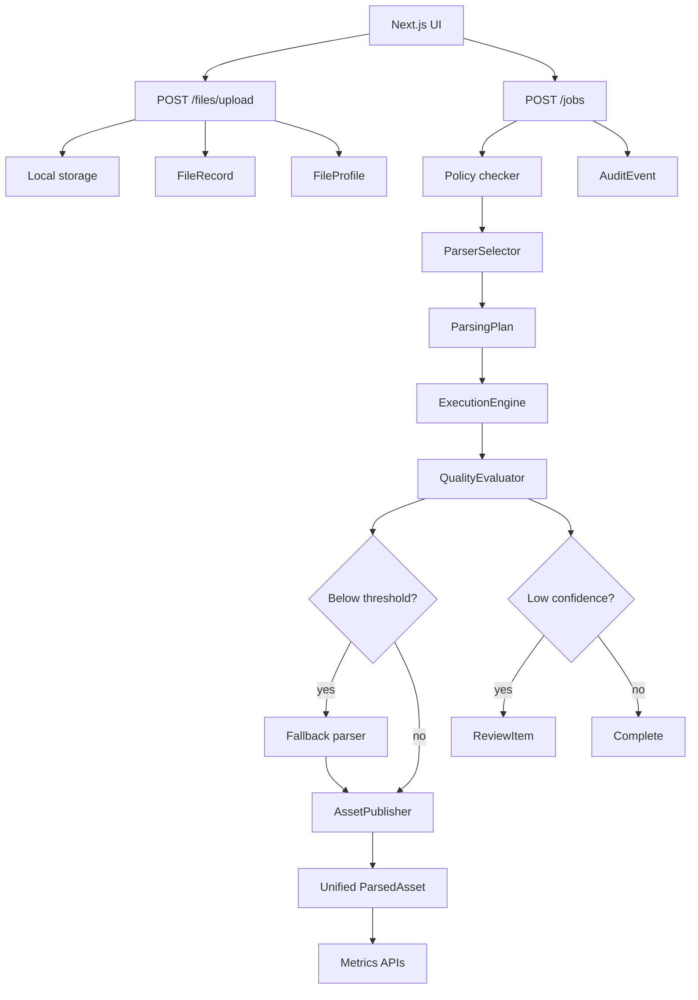

# Architecture

## Purpose

The Multimodal Parsing Agent coordinates governed file intake, parser selection, parsing execution, quality evaluation, fallback, skills, asset publishing, human review, audit, and observability.

## Backend Layers

- `api/routes`: FastAPI route modules for files, jobs, assets, registries, skills, MCP, audit, and observability.
- `schemas`: Pydantic API contracts, kept separate from SQLAlchemy models.
- `models`: SQLAlchemy persistence models for files, profiles, parsers, skills, jobs, plans, executions, quality, assets, review items, and audit events.
- `services`: File storage/profiling, parser registry, selector, planner, execution engine, fallback manager, quality evaluator, asset publisher, skills framework, governance, audit, and observability.
- `parsers`: Base parser contract plus local PDF/DOCX/HTML/OCR/VLM parser implementations.
- `skills`: Folder-based skill definitions with `SKILL.md`, `schema.json`, `validation_rules.yaml`, and examples.

## Flow

## Governance

Governance is intentionally lightweight in the MVP:

- `PolicyChecker` runs during planning.
- `PIIDetector` uses placeholder filename heuristics.
- `RestrictedDocumentDetector` uses explicit constraints and filename hints.
- Governance findings are recorded in parsing plan policy metadata and audit events.
- Restricted documents can be blocked with `block_restricted_documents`.

## Observability

Observability aggregates persisted state:

- job totals and success rate
- parser execution and usage metrics
- quality buckets
- fallback and review frequency
- latency metrics
- estimated cost
- parser execution errors
- audit events

## Local Parsing Runtime

The MVP favors local, Mac-friendly parsing paths before managed cloud services:

- `PdfNativeParser` uses PyMuPDF to extract text and layout blocks from digital PDFs.
- `DocxParser` uses python-docx to extract paragraphs and tables.
- `HtmlParser` uses BeautifulSoup to extract clean text, tables, and image metadata.
- `ImageOcrParser` and `TesseractAdapter` use Pillow plus pytesseract when the system
  `tesseract` binary is installed.
- `MockVlmParser` keeps its historical parser id for compatibility, but now acts as an
  LM Studio VLM adapter when `LM_STUDIO_ENABLED=true`.
- `MockEmbeddingService` can call LM Studio embeddings with `LM_STUDIO_EMBEDDING_ENABLED=true`,
  then falls back to deterministic mock vectors if the endpoint is unavailable.

Azure Document Intelligence remains in the registry as a managed-service adapter, but local
governance constraints can force selection toward OCR/VLM paths that do not require cloud access.

## Frontend

The frontend is a compact enterprise SaaS console built with Next.js App Router, TypeScript, Tailwind CSS, and lucide icons.

Primary views:

- Home / Upload
- Jobs
- Job Detail
- Parser Registry
- Skills Registry
- Human Review Queue
- Asset Viewer
- Observability

## Storage And Database

Local MVP defaults:

- SQLite: `sqlite:///./local.db`
- file storage: `./storage`

Docker Compose uses PostgreSQL and a named storage volume.

## Production Hardening Still Needed

- Alembic migrations
- async worker queue
- durable object storage
- production OCR/VLM/speech adapters and model lifecycle management
- authentication and authorization
- tenant isolation
- persisted human review decisions
- richer PII detection and policy packs
